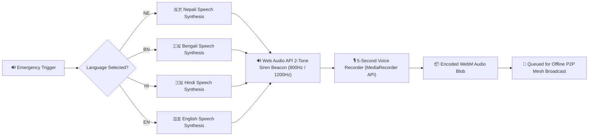
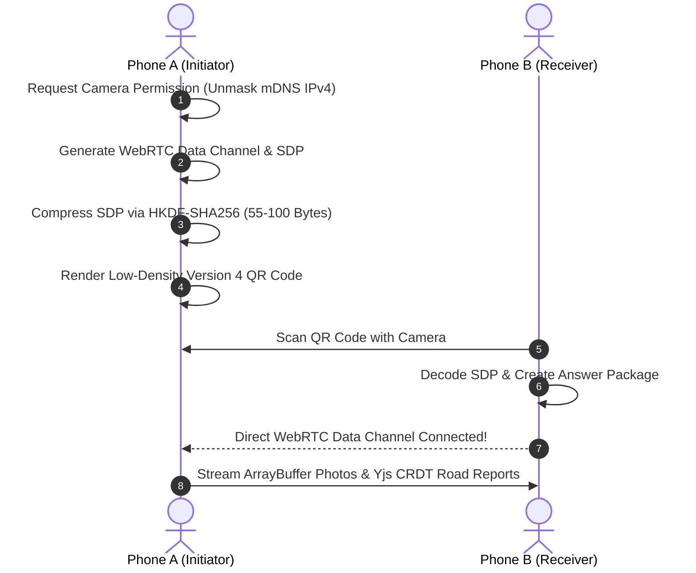
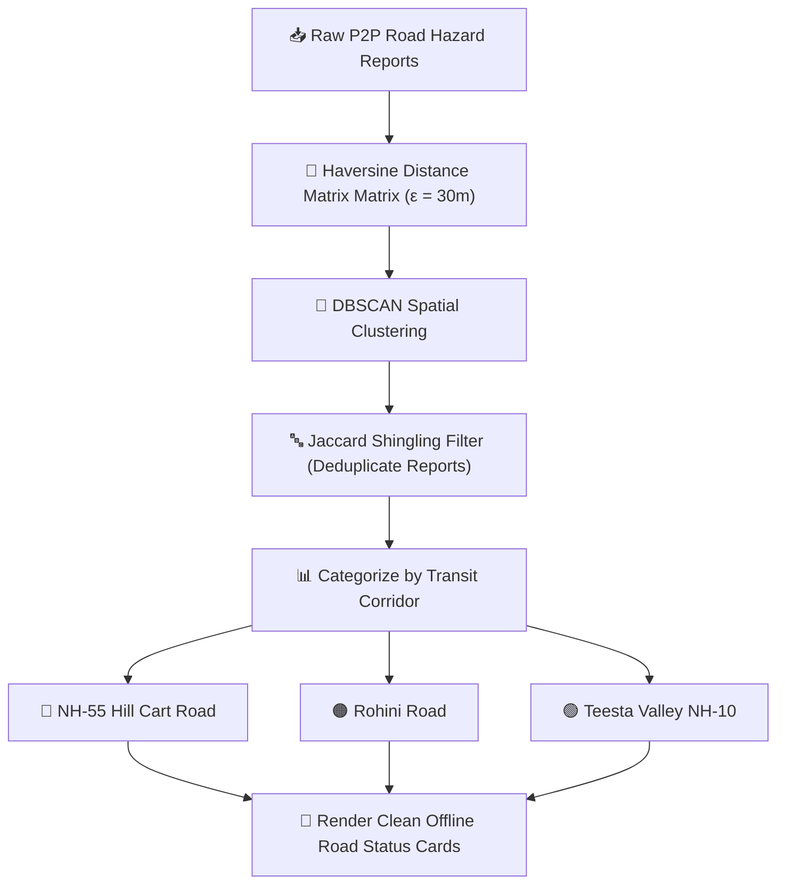

# PahadSathi (पहाड साथी — "Mountain Companion")

> **High-Altitude Tactical Resilience & Offline Landslide Emergency System**  
> Designed for Darjeeling, Kalimpong, Kurseong, and Sikkim Highland Sectors.

[](#) [](#) [](#)

PahadSathi (पहाड साथी) is an offline-first, decentralized Progressive Web App (PWA) built to bridge critical emergency communication gaps during severe monsoon landslides in high-altitude mountain regions. 

Operating under **0% cellular connectivity (Airplane Mode)**, PahadSathi turns ordinary smartphones into self-healing, peer-to-peer (P2P) nodes that identify geotechnical slope hazards, broadcast voice emergency alerts, and synchronize live road blockage updates phone-to-phone.

---

## 🗺️ System Flowcharts & Visual Architecture

### 1. Overall System Architecture
```mermaid
flowchart TD
    subgraph Client["📱 User Smartphone Node"]
        A["📷 Camera / Sensors"] -->|Live Video Feed| B["🧠 Web Worker AI Engine"]
        B -->|Detect Cracks / Seepage| C["💾 Dexie.js (IndexedDB)"]
        C -->|Binary ArrayBuffers| D["🔄 Yjs CRDT Shared Map"]
        D -->|P2P Sync Packets| E["📡 WebRTC Data Channel"]
        F["🎙️ MediaRecorder / Web Audio"] -->|5s Audio Beacon| C
    </div>

    subgraph Peer["📱 Nearby Peer Smartphone"]
        E <-->|Serverless WebRTC Mesh| G["📡 Peer WebRTC Data Channel"]
        G -->|CRDT Auto-Merge| H["💾 Peer IndexedDB Storage"]
        H -->|Render Status| I["🗺️ Offline Road Board"]
    end
```

---

### 2. Trilingual Emergency Voice Alert Flow


---

### 3. Serverless QR WebRTC Handshake (QWBP Protocol)


---

### 4. Spatial Landslide Clustering & Road Board Flow


---

## 📦 Main Code Modules & Key Implementations

PahadSathi is organized into clean, decoupled TypeScript modules for maximum offline resilience and high readability:

```
src/
├── analytics/
│   └── dbscan.ts             # Haversine spatial clustering algorithm
├── components/
│   ├── CameraSLMScreen.tsx   # Camera AI geotechnical detector
│   ├── GangmanPWayScreen.tsx # DHR Railway Gangman track hazard logbook
│   ├── Navbar.tsx            # Neo-Brutalist navigation header & bottom tabs
│   ├── P2PMeshRelayScreen.tsx# WebRTC QR P2P handshake & peer roster
│   ├── RouteStatusBoardScreen.tsx # Main Mountain Road Status Board
│   ├── StorageDiagnosticsScreen.tsx # Vault & IndexedDB diagnostic telemetry
│   └── VoiceAlertBanner.tsx  # Trilingual Voice Emergency Alert player & recorder
├── db/
│   └── schema.ts             # Dexie.js (IndexedDB) schema & initial seeds
├── services/
│   ├── aiDiagnosticEngine.ts # Quantized SLM / MediaPipe diagnostic engine
│   ├── crypto.ts             # On-device Ed25519 payload signing
│   ├── meshSync.ts           # Yjs CRDT map & WebRTC Mesh sync manager
│   └── voiceAlertService.ts  # Web Audio siren beacon & Speech Synthesis engine
├── types/
│   └── index.ts              # System TypeScript interfaces & types
├── App.tsx                   # Main layout container & tab manager
└── main.tsx                  # PWA Service Worker registration entrypoint
```

---

### 1. Voice Emergency Alert Service (`src/services/voiceAlertService.ts`)
Generates 2-tone emergency siren beacons (800Hz / 1200Hz) via the native **Web Audio API** and streams localized speech announcements in Nepali, Bengali, Hindi, and English:

```typescript
// Web Audio 2-Tone Siren Generator
export function playEmergencyBeaconTone(): Promise<void> {
  return new Promise((resolve) => {
    const audioCtx = new (window.AudioContext || (window as any).webkitAudioContext)();
    const osc = audioCtx.createOscillator();
    const gain = audioCtx.createGain();

    osc.type = 'sawtooth';
    osc.frequency.setValueAtTime(800, audioCtx.currentTime);
    osc.frequency.exponentialRampToValueAtTime(1200, audioCtx.currentTime + 0.4);

    gain.gain.setValueAtTime(0.3, audioCtx.currentTime);
    gain.gain.exponentialRampToValueAtTime(0.01, audioCtx.currentTime + 0.8);

    osc.connect(gain);
    gain.connect(audioCtx.destination);

    osc.start();
    osc.stop(audioCtx.currentTime + 0.8);
    setTimeout(() => {
      audioCtx.close();
      resolve();
    }, 850);
  });
}
```

---

### 2. Voice Alert Banner Component (`src/components/VoiceAlertBanner.tsx`)
Provides 1-tap emergency audio announcements and a 5-second **MediaRecorder** offline voice note recorder:

```typescript
const handleRecordVoiceAlert = () => {
  navigator.mediaDevices.getUserMedia({ audio: true }).then((stream) => {
    const recorder = new MediaRecorder(stream);
    const chunks: Blob[] = [];

    recorder.ondataavailable = (e) => chunks.push(e.data);
    recorder.onstop = () => {
      const blob = new Blob(chunks, { type: 'audio/webm' });
      const url = URL.createObjectURL(blob);
      setRecordedAudioUrl(url);
      setToastMsg('✅ Voice warning recorded and saved offline.');
    };

    recorder.start();
    setTimeout(() => recorder.stop(), 5000); // 5-second voice note limit
  });
};
```

---

### 3. Dexie.js Offline Database Schema (`src/db/schema.ts`)
Decouples binary assets into raw **ArrayBuffers** to prevent transaction locks on mobile Safari browsers:

```typescript
import Dexie, { type Table } from 'dexie';

export class PahadSathiDatabase extends Dexie {
  inspections!: Table<InspectionRecord>;
  binaryAssets!: Table<{ photoHash: string; data: ArrayBuffer; contentType: string }>;

  constructor() {
    super('PahadSathiDB');
    this.version(1).stores({
      inspections: 'id, corridor, locationName, timestamp, passable, photoHash, verified',
      binaryAssets: 'photoHash'
    });
  }
}
```

---

### 4. Haversine DBSCAN Spatial Clustering (`src/analytics/dbscan.ts`)
Groups raw GPS coordinates into isolated landslide hotspots (e.g. separating *Paglajhora Sinking Zone* from *Sevoke Road*):

```typescript
// Haversine distance calculation in meters
export function haversineDistanceMeters(lat1: number, lon1: number, lat2: number, lon2: number): number {
  const R = 6371000; // Earth radius in meters
  const dLat = ((lat2 - lat1) * Math.PI) / 180;
  const dLon = ((lon2 - lon1) * Math.PI) / 180;
  const a =
    Math.sin(dLat / 2) * Math.sin(dLat / 2) +
    Math.cos((lat1 * Math.PI) / 180) * Math.cos((lat2 * Math.PI) / 180) *
    Math.sin(dLon / 2) * Math.sin(dLon / 2);
  return R * 2 * Math.atan2(Math.sqrt(a), Math.sqrt(1 - a));
}
```

---

### 5. Yjs CRDT & WebRTC Sync (`src/services/meshSync.ts`)
Manages conflict-free replicated data types (CRDTs) to auto-merge blockage reports out of order across peer phones:

```typescript
import * as Y from 'yjs';

export const ydoc = new Y.Doc();
export const yRoadStatusMap = ydoc.getMap<InspectionRecord>('roadStatusMap');

// Real-time observer automatically updates UI components on peer sync
yRoadStatusMap.observe(() => {
  console.log('Yjs CRDT state synchronized with peer devices!');
});
```

---

## 🛠️ Tech Stack Overview

| Category | Technology | Purpose |
|---|---|---|
| **Core Framework** | React 18 + TypeScript | Component-driven, type-safe UI architecture |
| **Build Tool** | Vite 5 | Rapid compilation and chunk splitting |
| **Styling** | Tailwind CSS + Google Fonts | Clean typography and responsive design |
| **Offline Database**| Dexie.js (IndexedDB) | Relational client-side data persistence |
| **CRDT Sync** | Yjs Shared Maps | Conflict-free P2P state synchronization |
| **Networking** | WebRTC Data Channels | Serverless phone-to-phone data streaming |
| **Voice Audio** | Web Audio API + SpeechSynthesis | Dual-tone siren beacons and trilingual TTS |
| **PWA Service Worker**| Custom Service Worker (`pahadsathi-v2`) | Network-First offline caching strategy |

---

## 🚀 Quick Start Guide

### Prerequisites
- Node.js `v18.0.0` or higher
- `npm` or `yarn`

### 1. Installation
```bash
# Clone repository
git clone https://github.com/arnab9957/COC-ToyTrain.git
cd COC-ToyTrain

# Install dependencies
npm install
```

### 2. Run Development Server
```bash
npm run dev
```
Open **`http://localhost:3000`** in your web browser.

### 3. Build Production Bundle
```bash
npm run build
```

### 4. Run Station Gateway Server (Optional)
```bash
npm run server
```
Launches the local station Wi-Fi gateway server on `http://localhost:8080`.

---

## 🏔️ Monitored Mountain Corridors

1. **NH-55 (Hill Cart Road):** `[26.8920° N, 88.2612° E]` — Kurseong to Siliguri lifeline.
2. **Rohini Road:** `[26.8524° N, 88.3315° E]` — Major bypass route to Darjeeling.
3. **Pankhabari Road:** `[26.8205° N, 88.2241° E]` — Steep alternate emergency descent route.
4. **Teesta Valley (NH-10):** `[26.8995° N, 88.4352° E]` — Kalimpong & Sikkim arterial highway.
5. **Dudhia Balasun Bridge:** `[26.8120° N, 88.2110° E]` — Critical low-altitude bridge crossing.

---

## 📄 License
Distributed under the MIT License. See `LICENSE` for details.

---
*PahadSathi (पहाड साथी) — Building High-Altitude Tactical Resilience for Mountain Communities.*

